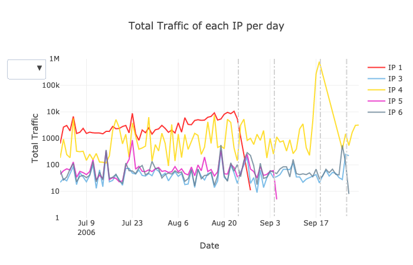

# Computer Security Data Visualization

This is a data visualization homework, the goal is to find if there exists suspicions activties. The data set consists 21,000+ rows and covers 10 local workstation IPs over 3 months.

## Packages Used
1. Plotly
2. Pandas
3. datetime

## Approach
I used R to group by workstation and date to produce a aggregate numbers because R is more handy to aggregate numbers. Then I used Plotly on Python to plot line charts by the targeted workstation IPs. 

## Visualization
Please find the visualization [here](https://jacquessham.github.io/computer_security_dataviz_viz/)
 
 
And it looks like this: 

